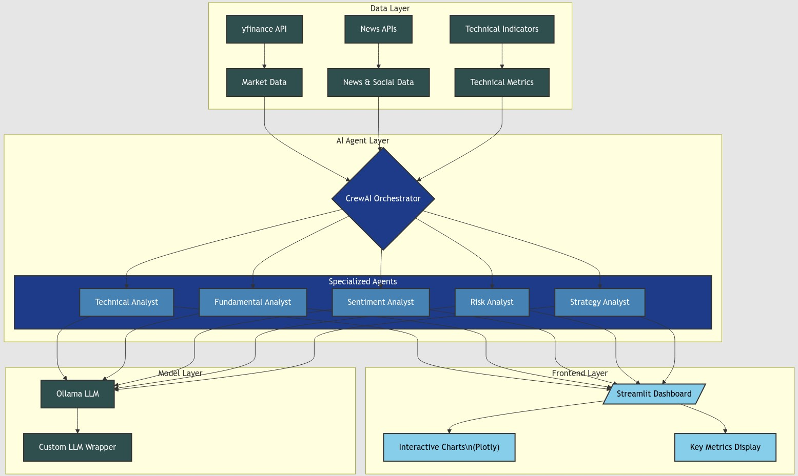

# Building WealthSense AI: The Intelligent Agent for Advanced Stock Analysis

Practical Guide : Revolutionizing Investment Strategies with AI-Powered Stock Insights

TL;DR

WealthSense AI represents a sophisticated approach to stock market analysis by combining multiple AI agents, each specialized in different aspects of financial analysis. The system leverages CrewAI and Ollama models to process market data, conduct technical and fundamental analysis, assess risks, and evaluate market sentiment. Through a Streamlit dashboard, it delivers comprehensive investment insights in real-time, demonstrating how AI can transform traditional financial analysis into an automated, intelligent process.

Full Article : [https://medium.com/@learn-simplified/building-wealthsense-ai-the-intelligent-agent-for-advanced-stock-analysis-f50da1eef918


Tech stack

| Category | Technologies | Purpose |
|----------|--------------|---------|
| Frontend Framework | Streamlit | Web interface for stock analysis application |
| AI/ML Framework | CrewAI, LangChain, Ollama | AI agent orchestration and LLM integration |
| Data Processing | Pandas, NumPy, SciPy | Data manipulation and statistical analysis |
| Financial Data | yfinance | Fetching stock market data and financial information |
| Visualization | Plotly | Interactive financial charts and data visualization |
| Technical Analysis | TA-Lib (ta) | Technical indicators and pattern recognition |
| Sentiment Analysis | TextBlob | Natural language processing for market sentiment |


## Introduction
In today’s fast-paced financial markets, making informed investment decisions requires processing vast amounts of data in real-time — a task that’s becoming increasingly challenging for human analysts alone. Enter WealthSense AI, an innovative platform that brings together artificial intelligence and traditional financial expertise to create a powerful tool for stock market analysis. Imagine having a team of tireless financial experts who can analyze markets 24/7, spot patterns in milliseconds, and process years of historical data in moments — that’s the power of WealthSense AI.
   
## What's This Project About

This article takes you on a journey through building a sophisticated AI-powered stock analysis system. At its core, WealthSense AI utilizes a multi-agent architecture where different AI specialists work together, much like a team of financial experts. The technical analyst agent scrutinizes price patterns and technical indicators, while the fundamental analyst digs deep into company financials. A sentiment analyst monitors market mood through news and social media, and a risk assessment specialist evaluates potential dangers.

The system integrates various modern technologies: the CrewAI framework orchestrates the AI agents, yfinance provides real-time market data, technical analysis tools process market patterns, and Plotly creates interactive visualizations. All of this comes together in a user-friendly Streamlit interface that makes complex financial analysis accessible to both professionals and retail investors.

## Why Work on It?

The integration of AI in business isn’t just a trend — it’s becoming a necessity for survival and growth in modern markets. This article demonstrates how businesses can practically implement AI solutions through WealthSense AI’s example. Here’s why this matters:

Financial Analysis Evolution:

- Traditional analysis methods can’t keep up with the volume and speed of modern markets
- AI can process massive amounts of data and identify patterns humans might miss
- Real-time analysis becomes possible across multiple markets simultaneously

Business Implementation:

- Shows how to break down complex problems into manageable AI tasks
- Demonstrates practical integration of multiple AI agents for better decision-making
- Provides a blueprint for scaling analysis capabilities without proportional cost increase

Competitive Advantage:

- Helps businesses understand how to leverage AI for market intelligence
- Shows how to combine different data sources for more accurate insights
- Demonstrates building user-friendly interfaces for complex AI systems

## Architecture

### Lets Build Trading Terminal Using AI Agents





# Tutorial: Lets Build Trading Terminal Using AI Agents

## Prerequisites
- Python installed on your system.
- A basic understanding of virtual environments and command-line tools.

## Steps

1. **Virtual Environment Setup:**
   - Create a dedicated virtual environment for our project:
   
     ```bash
     python -m venv Lets-Build-Trading-Terminal-Using-AI-Agents
     ```
   - Activate the environment:
   
     - Windows:
       ```bash
       Lets-Build-Trading-Terminal-Using-AI-Agents\Scripts\activate       
       ```
     - Unix/macOS:
       ```bash
       source Lets-Build-Trading-Terminal-Using-AI-Agents/bin/activate
       ```
   

# Installation and Setup Guide

**Install Project Dependencies:**

Follow these steps to set up and run the  "Lets Build Trading Terminal Using AI Agents"

1. Navigate to your project directory:
   ```
   cd path/to/your/project
   ```
   This ensures you're in the correct location for the subsequent steps.

2. Install the required dependencies:
   ```
   pip install -r requirements.txt   
   ```
   This command installs all the necessary Python packages listed in the requirements.txt file.


## Run - Hands-On Guide: Lets Build Trading Terminal Using AI Agents

   ```bash 
     
      # Run 
      streamlit run app.py
      
   ```


   