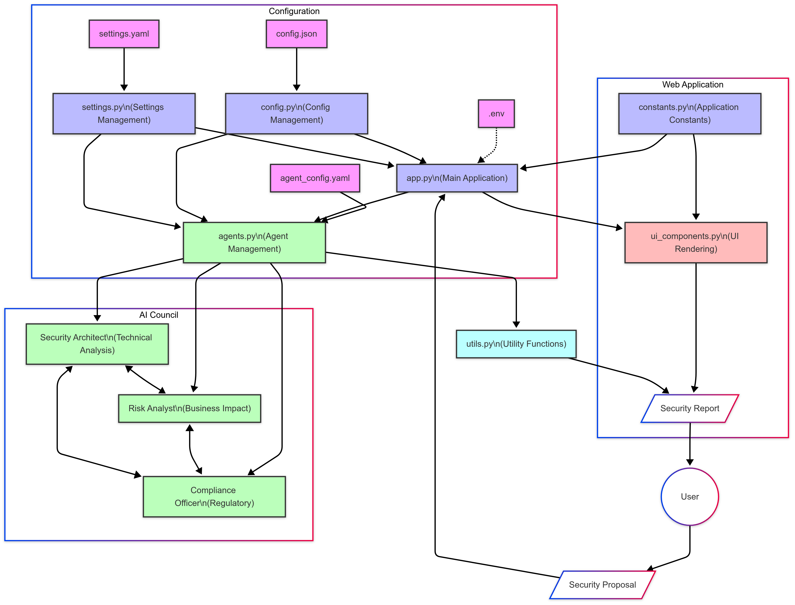

# Let's Build Enterprise Cybersecurity Risk Assessment Using AI Agents 

Collaborative AI: How Multiple Agents Create Better Security Assessments

## TL;DR
I built an app that uses multiple AI agents (Security Architect, Risk Analyst, and Compliance Officer) to automatically review security proposals from different perspectives. The agents discuss the proposal together and generate a comprehensive security report. The code shows how to orchestrate multiple agents, manage their conversation, and present their findings through a clean web interface.

## Introduction:
Ever been stuck waiting for the security team to review your project? Or maybe you’re on that security team, drowning in review requests? I built a system that uses AI agents to speed up cybersecurity risk assessments. The agents work together like a real security team — each with their own expertise and perspective — to provide comprehensive reviews in minutes instead of days.

## What’s This Article About?
This article walks through building an AI-powered security review system. I’ve created a Streamlit application where users can submit security proposals for analysis. Behind the scenes, a team of specialized AI agents works together to assess the proposal:

 - A Security Architect examines technical vulnerabilities and suggests controls
 - A Risk Analyst evaluates business impacts and quantifies potential losses
 - A Compliance Officer checks for regulatory adherence to standards like GDPR and HIPAA

These agents have a structured conversation, challenge each other’s perspectives, and ultimately produce a comprehensive security recommendation. The application then formats this into a downloadable report that summarizes their findings.

Full Article : [https://medium.com/@learn-simplified/lets-build-enterprise-cybersecurity-risk-assessment-using-ai-agents-6fd2e8be9056


## Tech Stack

| **Category**   | **Technology**                | **Purpose**                          |
|----------------|-------------------------------|--------------------------------------|
| Framework      | Streamlit                     | Web interface and UI components      |
| AI             | AutoGen                       | Multi-agent conversation framework   |
| AI             | OpenAI GPT-4                  | Large language model for agents      |
| Configuration  | YAML                          | Agent and application configuration  |
| Configuration  | JSON                          | LLM settings and feature flags       |
| Environment    | python-dotenv                | Environment variable management      |
| Utilities      | asyncio                       | Asynchronous processing              |
| Reporting      | Markdown                      | Report generation format              |
| Logging        | Python logging                | Application logging                  |


## Why Read It?
AI is transforming how businesses handle cybersecurity. According to Gartner, by 2026, organizations using AI in security will respond to incidents 80% faster than those that don’t. This article shows how even fictional companies like our “Enterprise Cyber AI Council” can implement AI agents to:

 - Scale security expertise across the organization
 - Standardize risk assessment processes
 - Dramatically reduce review turnaround times
 - Ensure consistent consideration of technical, business, and compliance perspectives

The approach demonstrated here can be adapted to your own organization’s security frameworks and risk appetite. By building this system, you’ll learn practical techniques for orchestrating AI agents that can be applied to many business processes beyond security.

## Architecture




# Tutorial: Let's Build Enterprise Cybersecurity Risk Assessment Using AI Agents

## Prerequisites
- Python installed on your system.
- A basic understanding of virtual environments and command-line tools.

## Steps

1. **Virtual Environment Setup:**
   - Create a dedicated virtual environment for our project:
   
     ```bash
     python -m venv Lets-Build-Enterprise-Cybersecurity-Risk-Assessment-Using-AI-Agents
     ```
   - Activate the environment:
   
     - Windows:
       ```bash
          Lets-Build-Enterprise-Cybersecurity-Risk-Assessment-Using-AI-Agents\Scripts\activate        
       ```
     - Unix/macOS:
       ```bash
       source Lets-Build-Enterprise-Cybersecurity-Risk-Assessment-Using-AI-Agents/bin/activate
       ```
   

# Installation and Setup Guide

**Install Project Dependencies:**

Follow these steps to set up and run the  "Let's Build Enterprise Cybersecurity Risk Assessment Using AI Agents"

1. Navigate to your project directory:
   ```
   cd path/to/your/project
   ```
   This ensures you're in the correct location for the subsequent steps.

2. Install the required dependencies:
   ```
   pip install -r requirements.txt   
   ```
   This command installs all the necessary Python packages listed in the requirements.txt file.


Run - Hands-On Guide: Let's Build Enterprise Cybersecurity Risk Assessment Using AI Agents

  
   ```
   streamlit run app.py
   ```
   


