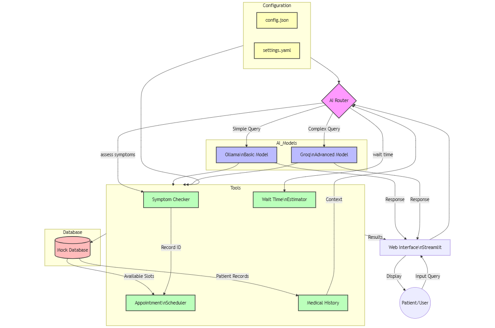

# Let's Build AI Router for Healthcare Triage System

Practical AI Implementation in Healthcare - From Concept to Code

# TL;DR

Built a dual-model AI triage system for healthcare that smartly routes patient queries — simple questions go to a basic AI model, complex medical concerns go to an advanced model. Added tools for symptoms checking, appointment scheduling, and wait time estimates. Everything’s configurable and safety-focused.

Full Article : [https://medium.com/@learn-simplified/lets-build-ai-router-for-healthcare-triage-system-1f100b19ec2f


# Tech stack
## Let's Build AI Router for Healthcare Triage System

## Frontend Technologies
| Category | Technology | Version | Purpose |
|----------|------------|----------|----------|
| **Core Framework** | Python | 3.x | Base programming language |
| **Web Interface** | Streamlit | >= 1.31.0 | Interactive web UI for healthcare triage |
| **AI Models** | Langchain-core | >= 0.1.27 | Base AI orchestration |
| | Langchain-groq | >= 0.0.8 | Advanced medical query handling |
| | Langchain-community | >= 0.0.24 | Community LLM integrations |
| | Ollama | llama3.2:3b | Basic query processing |
| | Groq | mixtral-8x7b-32768 | Complex medical query processing |
| **Data Handling** | PyYAML | Built-in | Configuration management |
| | JSON | Built-in | Data structuring & API responses |
| | Python-dotenv | >= 1.0.1 | Environment variable management |
| **Type System** | Pydantic | >= 2.6.1 | Data validation |
| | Typing-extensions | >= 4.9.0 | Enhanced type hints |
| **Time Management** | Pytz | >= 2024.1 | Timezone handling |
| **Development Tools** | Mock Database | Custom | Simulated healthcare data storage |
| **Configuration** | YAML | N/A | Complex system settings |
| | JSON | N/A | API configurations |


## Introduction
Remember the last time you needed medical help but weren’t sure if it was urgent? That’s exactly why I built this AI triage system. After reading on various healthcare providers, one challenge kept coming up: efficiently handling patient inquiries while ensuring urgent cases get immediate attention..

## Architecture

### Let's Build AI Router for Healthcare Triage System




## What’s This Article About?
Think of this system as a smart medical receptionist powered by AI. The core innovation is the AI router that decides which of two AI models should handle each patient query. Simple questions about appointments or wait times go to a lightweight model, while complex medical questions get routed to a more powerful model. The system includes practical tools for checking symptoms, scheduling appointments, and estimating wait times — all while prioritizing patient safety.


## Why Read It?
AI isn’t just buzzword anymore — it’s transforming how businesses operate. This article shows you a practical implementation in healthcare. Through our example healthcare provider, you’ll see how:

 - AI can handle routine tasks while escalating urgent cases
 - Different AI models can work together based on task complexity
 - Real-world business tools can integrate with AI systems
 - Safety and error handling work in critical applications
 - Configuration management makes systems adaptable


# Tutorial: Let's Build AI Router for Healthcare Triage System

## Prerequisites
- Python installed on your system.
- A basic understanding of virtual environments and command-line tools.

## Steps

1. **Virtual Environment Setup:**
   - Create a dedicated virtual environment for our project:
   
     ```bash
     python -m venv My-Building-of-AI-warehouse-manager
     ```
   - Activate the environment:
   
     - Windows:
       ```bash
       My-Building-of-AI-warehouse-manager\Scripts\activate       
       ```
     - Unix/macOS:
       ```bash
       source My-Building-of-AI-warehouse-manager/bin/activate
       ```
   

# Installation and Setup Guide

**Install Project Dependencies:**

Follow these steps to set up and run the  "Let's Build AI Router for Healthcare Triage System"

1. Navigate to your project directory:
   ```
   cd path/to/your/project
   ```
   This ensures you're in the correct location for the subsequent steps.

2. Install the required dependencies:
   ```
   pip install -r requirements.txt   
   ```
   This command installs all the necessary Python packages listed in the requirements.txt file.


## Run - Hands-On Guide: Let's Build AI Router for Healthcare Triage System

   ```bash 
     
      # Run 
      streamlit run app.py
      
   ```
