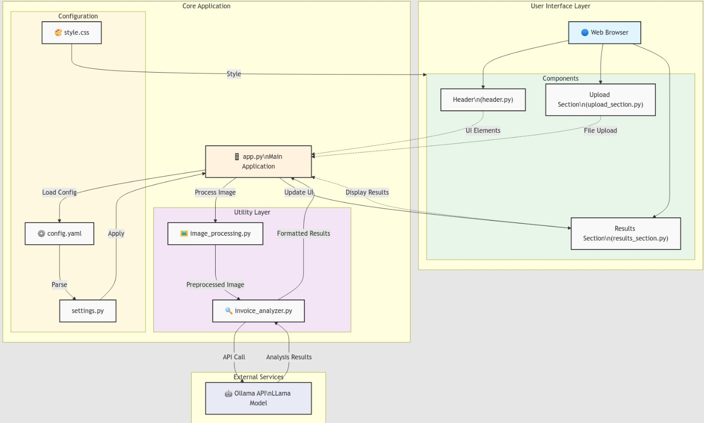

# Let's Build Invoice Processing Using AI Agents

Practical Guide : InvoiceSense AI: Smart Invoice Processing Made Simple — Extract, Analyze, Done

TL;DR

In this hands-on guide, we’ll build a professional invoice processing application using AI Agents. You’ll learn how to create a web interface that can analyze invoices, build agentic system which extract key information, and present it in a clean format. Perfect for developers looking to automate document processing or explore practical AI applications.

Full Article : [https://medium.com/@learn-simplified/lets-build-invoice-processing-system-using-ai-agents-8b6814f0e2ad


## What's This Project About

Imagine having an assistant that could read invoices and instantly tell you all the important details — the total amount, due date, line items, and more. That’s exactly what we’re building today! We’ll create a web application where you can upload any invoice image, and our AI agent (powered by Llama via Ollama) will analyze it and present the information in a clean, organized format.

This isn’t just another tutorial — we’re building a real-world application that showcases how to combine modern AI capabilities with web development. Whether you’re a developer looking to automate document processing or someone curious about practical AI applications, this project will give you hands-on experience with these technologies.

## Why Work on It?

Have you ever wondered how to make AI work for real business problems? This tutorial shows you exactly that. You’ll learn:

- How to structure a professional Python application with proper configuration management
- How to create a clean, responsive web interface without being a frontend expert
- How to integrate AI capabilities into your applications
- Best practices for handling document processing and user uploads
- How to make your code maintainable and scalable

## Architecture

### Let's Build Invoice Processing Using AI Agents




mplex, hard-to-maintain system into a streamlined, efficient solution. The visual approach to code analysis proved invaluable in identifying and fixing issues before they became problems.


# Tutorial: Let's Build Invoice Processing Using AI Agents

## Prerequisites
- Python installed on your system.
- A basic understanding of virtual environments and command-line tools.

## Steps

1. **Virtual Environment Setup:**
   - Create a dedicated virtual environment for our project:
   
     ```bash
     python -m venv Lets-Build-Invoice-Processing-Using-AI-Agents
     ```
   - Activate the environment:
   
     - Windows:
       ```bash
       Lets-Build-Invoice-Processing-Using-AI-Agents\Scripts\activate       
       ```
     - Unix/macOS:
       ```bash
       source Lets-Build-Invoice-Processing-Using-AI-Agents/bin/activate
       ```
   
# Installation and Setup Guide

**Install Project Dependencies:**

Follow these steps to set up and run the  "Let's Build Invoice Processing Using AI Agents"

1. Navigate to your project directory:
   ```
   cd path/to/your/project
   ```
   This ensures you're in the correct location for the subsequent steps.

2. Install the required dependencies:
   ```
   pip install -r requirements.txt   
   ```
   This command installs all the necessary Python packages listed in the requirements.txt file.


## Run - Hands-On Guide: Let's Build Invoice Processing Using AI Agents

   ```bash 
     
      # Run 
      streamlit run streamlit_app.py
      
   ```


   